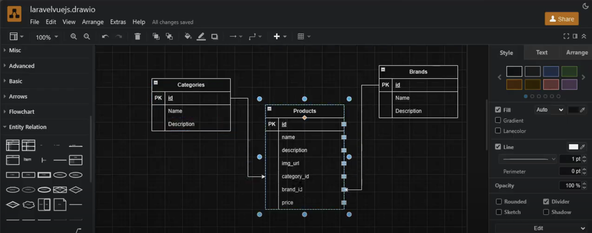

# Laravel & Vue.js Project

[

](https://laravel.com/)

A modern web application built with **Laravel** and **Vue.js** , combining a powerful backend API with a dynamic frontend.

## About Laravel

Laravel is a PHP web application framework known for its expressive and elegant syntax. It aims to make development an enjoyable and creative experience by simplifying common tasks, including:

-   Robust authentication and authorization
-   Eloquent ORM for seamless database interactions
-   Blade templating for dynamic views
-   RESTful API development
-   Task scheduling and queue management

This project integrates Laravel with Vue.js to deliver a full-stack application with a responsive frontend and a secure backend.

## Prerequisites

Before running the project, ensure you have the following installed:

-   **PHP** (>= 8.0)
-   **Composer** (for PHP dependencies)
-   **Node.js** and **npm** (for Vue.js frontend)
-   **MySQL** or another database supported by Laravel
-   A web server (e.g., Apache, Nginx, or Laravel's built-in server)
-   **Git** (optional, for cloning the repository)

## Getting Started

Follow these steps to set up and run the project locally:

### 1. Clone the Repository

```bash
git clone <repository-url>
cd project_name
```

### 2. Install Backend Dependencies

Navigate to the project root and install PHP dependencies using Composer:

```bash
composer install
```

### 3. Install Frontend Dependencies

Install Node.js dependencies for the Vue.js frontend:

```bash
npm install
```

### 4. Configure Environment

-   Copy the `.env.example` file to create a `.env` file:
    ```bash
    cp .env.example .env
    ```
-   Generate an application key:
    ```bash
    php artisan key:generate
    ```
-   Update the `.env` file with your database credentials:
    ```env
    DB_CONNECTION=mysql
    DB_HOST=127.0.0.1
    DB_PORT=3306
    DB_DATABASE=laravelvuejs
    DB_USERNAME=root
    DB_PASSWORD=
    ```

### 5. Run Database Migrations

Set up the database schema by running migrations:

```bash
php artisan migrate
```

### 6. Start the Laravel Backend

Launch the Laravel development server:

```bash
php artisan serve
```

The API will be available at `http://127.0.0.1:8000`. You can access endpoints like:

-   `api/categories`
-   `api/brands`
-   `api/products`

### 7. Start the Vue.js Frontend

Compile and run the Vue.js frontend in development mode:

```bash
npm run dev
```

The frontend will typically be accessible at `http://localhost:5173` (check Vite's output for the exact URL).

## API Endpoints

The Laravel backend provides the following API endpoints:

-   **GET /api/categories** : Retrieve all categories
-   **GET /api/brands** : Retrieve all brands
-   **GET /api/products** : Retrieve all products

## Screenshots

Below is a preview of the application:



## Troubleshooting

-   **Missing App Key** : If you encounter a `MissingAppKeyException`, ensure the `APP_KEY` is set in the `.env` file by running `php artisan key:generate`.
-   **Database Errors** : Verify your database connection settings in `.env` and ensure the database exists.
-   **Node Modules Issues** : If `npm run dev` fails, try deleting `node_modules` and `package-lock.json`, then run `npm install` again.
-   **CORS Issues** : If the frontend cannot connect to the API, check Laravel's CORS configuration in `config/cors.php`.

## Enjoy the Project

Dive into the code, explore the features, and learn from this Laravel and Vue.js integration. Feel free to customize and extend it to suit your needs!

## License

This project is open-source and licensed under the [MIT License](https://opensource.org/licenses/MIT).
